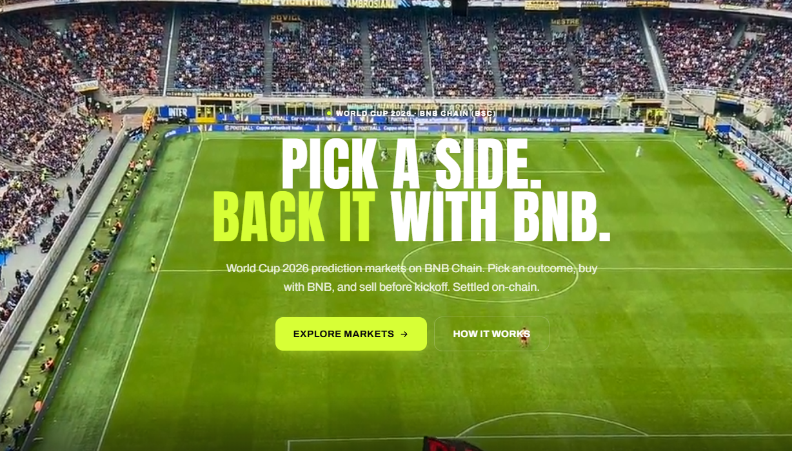
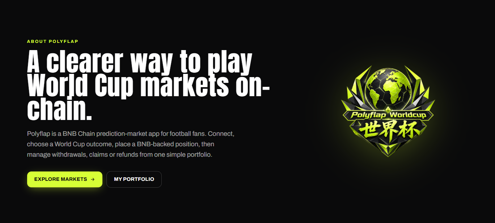
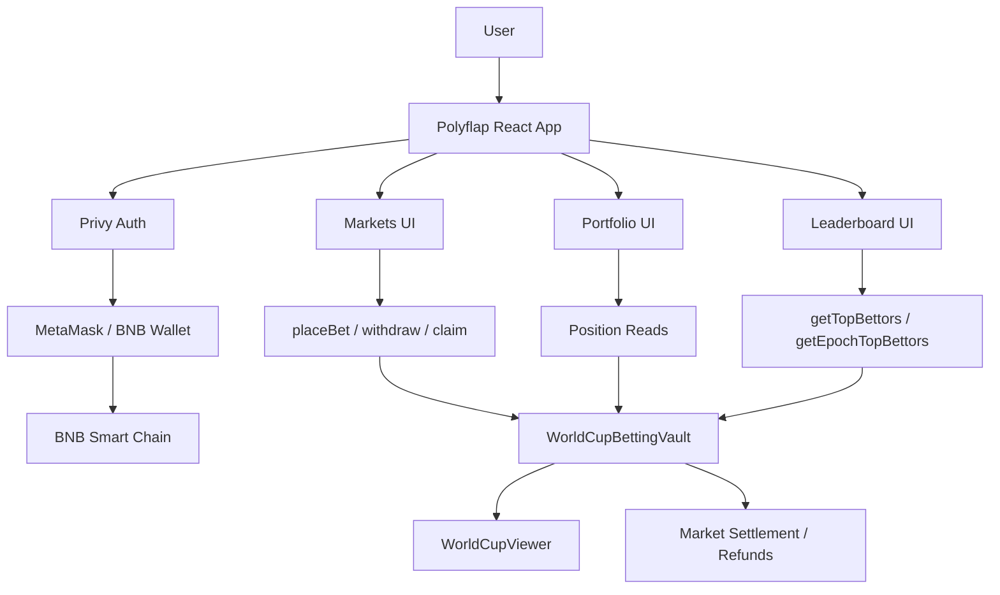
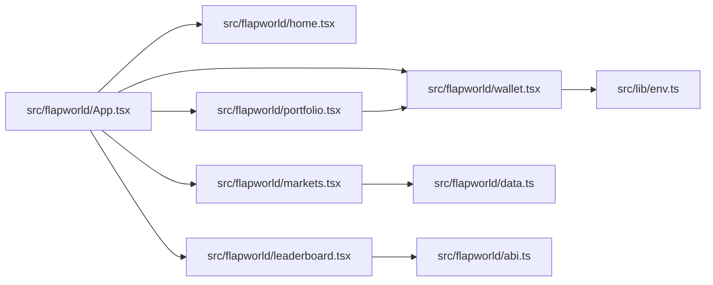
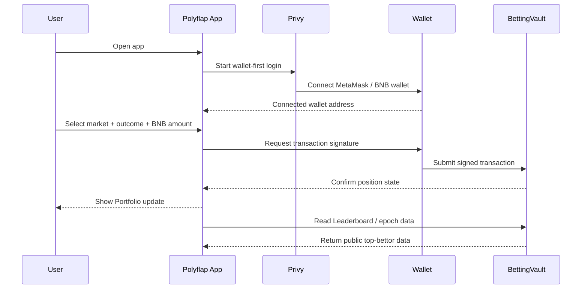
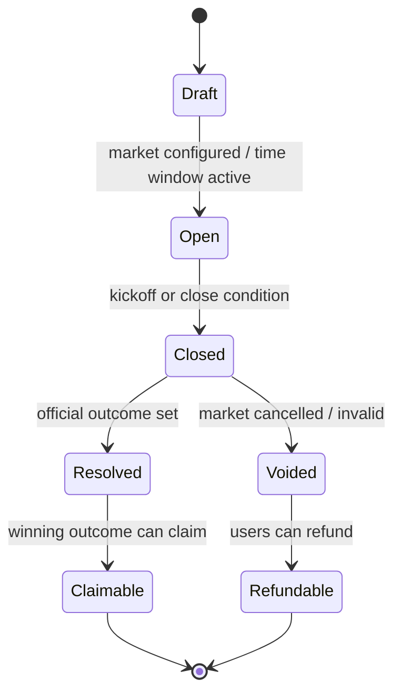
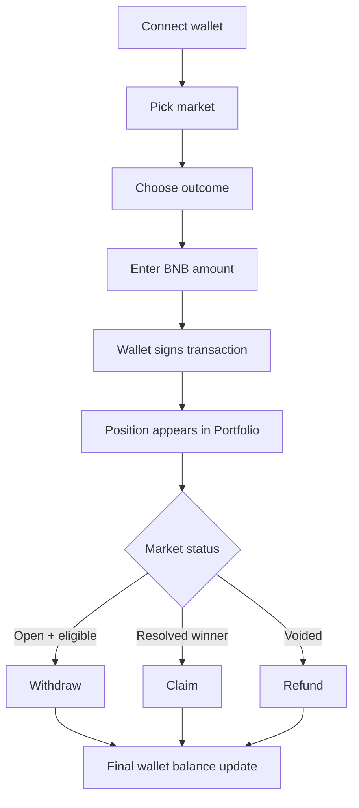
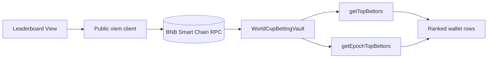

# Polyflap WorldCup — BNB Chain Prediction Markets

<p align="center">
  
</p>

<p align="center">
  <strong>Wallet-first World Cup 2026 prediction markets on BNB Smart Chain.</strong><br />
  Pick an outcome, back it with BNB, manage positions from Portfolio, and verify public activity through on-chain data.
</p>

<p align="center">
  <a href="#product-overview">Overview</a> ·
  <a href="#screenshots">Screenshots</a> ·
  <a href="#architecture">Architecture</a> ·
  <a href="#smart-contracts">Smart Contracts</a> ·
  <a href="#local-development">Local Development</a> ·
  <a href="#verification">Verification</a>
</p>

---

## Product Overview

Polyflap WorldCup is a customer-facing prediction-market app for football fans. The current product is designed around a reliable wallet-first flow:

1. Connect MetaMask or another BNB-compatible wallet through Privy.
2. Browse World Cup match, group, and tournament markets.
3. Choose an outcome and enter a BNB-backed position.
4. Sign every transaction from the connected wallet.
5. Track active positions in Portfolio.
6. Withdraw eligible open positions, claim winning outcomes, or receive refunds after settlement.
7. View public top-bettor activity on the on-chain Leaderboard.

The product keeps the public UI simple while leaving important money movement verifiable through wallet signatures, BNB Smart Chain transactions, and contract reads.

> Polyflap is not affiliated with FIFA and does not provide financial advice. Users should only participate with funds they are willing to risk.

---

## Screenshots

### Landing Page

<p align="center">
  
</p>

### About Page

<p align="center">
  
</p>

### Markets Entry

<p align="center">
  
</p>

---

## Core Features

| Area | What it does |
| --- | --- |
| Wallet-first login | Privy-powered entry with MetaMask and BNB-compatible wallets as the primary live path. |
| World Cup markets | Match, group, and outright World Cup 2026 markets. |
| BNB positions | Users back outcomes with BNB on BNB Smart Chain. |
| Portfolio | Connected-wallet position management: active bets, withdrawals, claims, and refunds. |
| On-chain Leaderboard | Public top-bettor view sourced from BettingVault contract reads. |
| Reward epoch visibility | Epoch-weighted activity and reward context around top bettors. |
| Flap vault integration | Custom vault/factory work for the broader Flap ecosystem. |
| Multilingual UI | Frontend copy includes English and Chinese variants through inline app i18n helpers. |

---

## Architecture



### Frontend Modules



### User Flow



---

## Smart Contracts

This repository contains both the customer-facing frontend and the Solidity work for the Flap vault / World Cup betting system.

### Current configured BSC contracts

| Contract | Address |
| --- | --- |
| Vault implementation | `0x95005A1c1A737c0CdF32df3fb893EA3c2E2934e3` |
| Vault beacon | `0xFa2aB705f0e4998cc5bC9aCE7EeB2E32953a64Da` |
| Flap launch factory | `0x1f7A242CdF77C5beD1F80E9Fa421C691B7aA6aCe` |
| Betting vault | `0x9a2cEe430A7dE1A0b56e12Af2B313f643d5b5FF3` |
| WorldCupViewer | `0x00036192958C2aaAF9F445d3Cdc2979995EA333e` |
| Active Flap token | Unset until final token launch |
| Active Flap vault clone | Unset until final token/vault launch |

Fixed Flap launch URL:

```text
https://flap.sh/launch?vaultfactory=0x1f7A242CdF77C5beD1F80E9Fa421C691B7aA6aCe
```

ABI-encoded `vaultData` for the final token launch:

```text
0x00000000000000000000000000036192958c2aaaf9f445d3cdc2979995ea333e000000000000000000000000eb155312eeca8bbb3600f6e64b09fad04febf9d10000000000000000000000009a2cee430a7de1a0b56e12af2b313f643d5b5ff3
```

Important: do not use temporary token/vault deployments for production. Keep `VITE_FLAP_TOKEN_ADDRESS` and `VITE_FLAP_VAULT_ADDRESS` empty until the final launch creates the real token and vault clone.

### Deprecated addresses

These addresses are kept for historical context only and should not be used in production flows:

| Address | Reason |
| --- | --- |
| `0x8257f357cee6c3ee77f5b89818d9ee9bfecd72f6` | Malformed EIP-1167 clone bytecode and generic ThirdParty UI fallback. |
| `0xc6f9e1e06699209507c95e4eb23b6ee68901afa3` | Older visual-good factory, superseded by the fixed three-field factory. |
| `0xbf4fc44eedc13aff33633d29383323068d348125` | Old admin-heavy UI implementation/factory path. |

---

## Repository Map

```text
.
├── contracts/                         # Solidity vault contracts and factory work
├── docs/                              # Research, product notes, UI-schema docs
│   └── assets/readme/                 # README screenshots
├── foundry/worldcup-betting/          # Betting-vault contract workspace and scripts
├── schemas/                           # Flap UI schema references
├── scripts/                           # Validation, deployment, encoding, test scripts
└── src/
    ├── flapworld/                     # Main React product surface
    │   ├── home.tsx                   # Landing + About page
    │   ├── markets.tsx                # Market browsing and bet slip UI
    │   ├── portfolio.tsx              # Connected-wallet position management
    │   ├── leaderboard.tsx            # On-chain top bettors and reward epoch
    │   ├── wallet.tsx                 # Privy + viem wallet/trading layer
    │   ├── data.ts                    # World Cup market data
    │   └── abi.ts                     # Contract ABI fragments
    └── lib/env.ts                     # Public frontend environment config
```

---

## Technology Stack

| Layer | Tools |
| --- | --- |
| Frontend | React 19, TypeScript, Vite 8 |
| Styling / Motion | Tailwind CSS 4, GSAP, Framer Motion |
| Web3 | Privy, viem, BNB Smart Chain |
| Contracts | Solidity, solc scripts, Foundry-style betting workspace |
| Deployment target | GitHub + Vercel for the frontend; BSC for contracts |

---

## Local Development

### Prerequisites

- Node.js compatible with the project toolchain
- npm
- A BNB-compatible wallet such as MetaMask for live wallet testing
- Public frontend env vars configured in `.env.local`

### Install

```bash
cp .env.example .env.local
npm ci
npm run dev
```

Local Vite server:

```text
http://localhost:5173/
```

### Frontend environment

The app reads public runtime configuration from `src/lib/env.ts` and `.env.local`. Keep private secrets out of frontend env files. Only public `VITE_*` values should be exposed to the browser.

Typical live values include:

```text
VITE_PRIVY_APP_ID=...
VITE_PRIVY_CLIENT_ID=...
VITE_BSC_RPC_URL=...
VITE_BETTING_VAULT_ADDRESS=...
VITE_WORLDCUP_VIEWER_ADDRESS=...
```

---

## Verification

Run these before pushing changes:

```bash
npm run validate:schema
npm run test:worldcup
npm run build
```

For frontend-only copy or README updates, at minimum run:

```bash
npm run build
```

Current build notes: Vite/Rolldown may print dependency warnings from third-party packages such as Privy or WalletConnect. The important acceptance check is that the build exits successfully.

---

## Product Mechanics

### Market lifecycle



### Position lifecycle



### Leaderboard data path



---

## Design Principles

- Wallet-first, not account-first.
- No automatic betting: every market action needs wallet confirmation.
- Customer-facing pages should avoid internal deployment clutter.
- Public stats should come from chain reads when possible.
- The About page should describe the reliable live path, not experimental social-login promises.
- Portfolio is private to the connected wallet; Leaderboard is public market activity.

---

## Collaboration

Production deploys are expected to run from the `main` branch once the Vercel project is connected to this GitHub repository. Recommended workflow:

1. Create a focused branch or commit on `main` for small changes.
2. Run verification commands.
3. Push to GitHub.
4. Let Vercel build from GitHub.
5. Verify the deployed frontend and wallet flow.

---

## License / Status

This repository is a product and contract workspace for Polyflap WorldCup. Review contract code, deployment configuration, and jurisdictional requirements before using with real funds.
